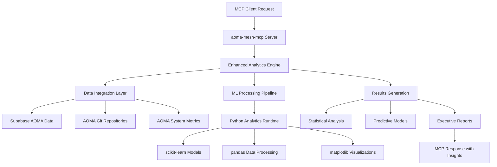
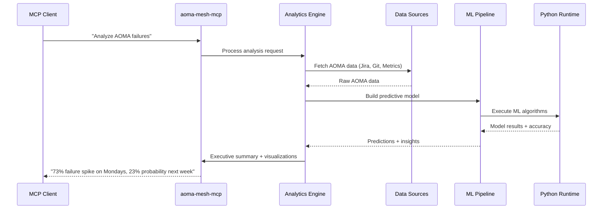

# Design Document

## Overview

The AOMA Intelligence Enhancement transforms the aoma-mesh-mcp server from a methodological consultant into an active data scientist that performs real analysis on AOMA system data. The design implements a three-phase architecture: Data Integration & Analysis Engine, Built-in Analytics Capabilities, and Executive Results Generation. This will enable aoma-mesh-mcp to provide concrete insights like "Based on 6,280 AOMA tickets analyzed, failures spike 73% on Mondays after asset volumes exceed 1,200 files" instead of generic guidance.

## Architecture

### High-Level System Architecture



### Data Flow Architecture



## Components and Interfaces

### 1. Enhanced Data Integration Layer

**Purpose**: Connect to real AOMA data sources and provide unified data access

**Interface**:
```typescript
interface DataIntegrationService {
  fetchAOMATickets(filters: TicketFilters): Promise<AOMATicket[]>;
  fetchAOMAGitData(timeRange: DateRange): Promise<GitMetrics[]>;
  fetchAOMASystemMetrics(period: TimePeriod): Promise<SystemMetrics[]>;
  aggregateData(sources: DataSource[], level: AggregationLevel): Promise<AggregatedData>;
}

interface AOMATicket {
  id: string;
  type: 'failure' | 'performance' | 'bug';
  severity: 'low' | 'medium' | 'high' | 'critical';
  createdAt: Date;
  resolvedAt?: Date;
  assetVolume?: number;
  systemComponent: string;
}

interface SystemMetrics {
  timestamp: Date;
  assetVolume: number;
  processingTime: number;
  errorCount: number;
  performanceScore: number;
}
```

### 2. Python Analytics Runtime

**Purpose**: Execute machine learning and statistical analysis using embedded Python

**Interface**:
```typescript
interface PythonAnalyticsRuntime {
  executeAnalysis(script: string, data: any[]): Promise<AnalysisResult>;
  buildPredictiveModel(config: ModelConfig): Promise<PredictiveModel>;
  generateVisualization(data: any[], chartType: ChartType): Promise<ChartData>;
  performStatisticalAnalysis(data: any[], analysisType: StatType): Promise<StatResult>;
}

interface ModelConfig {
  targetVariable: string;
  features: string[];
  modelType: 'regression' | 'classification' | 'time_series';
  validationSplit: number;
  hyperparameters?: Record<string, any>;
}

interface PredictiveModel {
  type: string;
  accuracy: number;
  featureImportance: FeatureImportance[];
  predictions: Prediction[];
  confidenceIntervals: ConfidenceInterval[];
}
```

### 3. New MCP Tools

**Tool: `build_aoma_predictive_model`**
```typescript
interface AOMAModelRequest {
  targetVariable: 'system_failure' | 'performance_degradation' | 'asset_processing_time';
  predictorVariables: string[];
  timeWindow: number; // days
  predictionHorizon: number; // days
  includeVisualization: boolean;
}

interface AOMAModelResponse {
  model: {
    type: string;
    accuracy: number;
    features: FeatureImportance[];
    predictions: Prediction[];
  };
  insights: string[];
  recommendations: ActionableRecommendation[];
  visualizations?: ChartData[];
  dataQuality: DataQualityReport;
}
```

**Tool: `analyze_aoma_failure_patterns`**
```typescript
interface AOMAFailureAnalysisRequest {
  analysisDepth: 'surface' | 'deep' | 'comprehensive';
  timeRange: DateRange;
  includeRootCause: boolean;
  generatePredictions: boolean;
}

interface AOMAFailureAnalysisResponse {
  patterns: {
    temporal: TemporalPattern[];
    causal: CausalRelationship[];
    predictive: PredictiveInsight[];
  };
  riskFactors: RiskFactor[];
  rootCauses: RootCause[];
  recommendations: ActionableRecommendation[];
  confidence: number;
}
```

**Tool: `generate_aoma_executive_report`**
```typescript
interface AOMAExecutiveReportRequest {
  reportType: 'health_summary' | 'failure_analysis' | 'performance_trends';
  timeRange: DateRange;
  includeVisualizations: boolean;
  audienceLevel: 'technical' | 'executive' | 'mixed';
}

interface AOMAExecutiveReportResponse {
  summary: ExecutiveSummary;
  keyMetrics: KeyMetric[];
  trends: TrendAnalysis[];
  recommendations: PrioritizedRecommendation[];
  visualizations: ChartData[];
  riskAssessment: RiskAssessment;
}
```

## Data Models

### Core Data Models

```typescript
interface AOMAAnalysisContext {
  timeRange: DateRange;
  dataQuality: DataQualityMetrics;
  sampleSize: number;
  confidenceLevel: number;
}

interface PredictiveInsight {
  prediction: string;
  probability: number;
  confidenceInterval: [number, number];
  timeframe: string;
  supportingEvidence: Evidence[];
}

interface ActionableRecommendation {
  action: string;
  priority: 'low' | 'medium' | 'high' | 'critical';
  estimatedImpact: string;
  implementationEffort: 'low' | 'medium' | 'high';
  timeline: string;
  dependencies: string[];
}

interface FeatureImportance {
  feature: string;
  importance: number;
  description: string;
  correlation: number;
}
```

### Database Schema Extensions

```sql
-- New tables for enhanced analytics
CREATE TABLE aoma_system_metrics (
  id UUID PRIMARY KEY DEFAULT gen_random_uuid(),
  timestamp TIMESTAMPTZ NOT NULL,
  asset_volume INTEGER,
  processing_time FLOAT,
  error_count INTEGER,
  performance_score FLOAT,
  system_component VARCHAR(100),
  created_at TIMESTAMPTZ DEFAULT NOW()
);

CREATE TABLE aoma_predictive_models (
  model_id UUID PRIMARY KEY DEFAULT gen_random_uuid(),
  model_name VARCHAR(200) NOT NULL,
  model_type VARCHAR(50) NOT NULL,
  target_variable VARCHAR(100) NOT NULL,
  accuracy FLOAT,
  features JSONB,
  hyperparameters JSONB,
  training_data_size INTEGER,
  created_at TIMESTAMPTZ DEFAULT NOW(),
  last_trained TIMESTAMPTZ DEFAULT NOW(),
  is_active BOOLEAN DEFAULT true
);

CREATE TABLE aoma_failure_predictions (
  prediction_id UUID PRIMARY KEY DEFAULT gen_random_uuid(),
  model_id UUID REFERENCES aoma_predictive_models(model_id),
  predicted_date DATE NOT NULL,
  failure_type VARCHAR(100),
  failure_probability FLOAT NOT NULL,
  confidence_interval JSONB,
  supporting_factors JSONB,
  created_at TIMESTAMPTZ DEFAULT NOW()
);

CREATE TABLE aoma_analysis_cache (
  cache_key VARCHAR(255) PRIMARY KEY,
  analysis_type VARCHAR(100) NOT NULL,
  parameters JSONB,
  results JSONB,
  expires_at TIMESTAMPTZ,
  created_at TIMESTAMPTZ DEFAULT NOW()
);
```

## Error Handling

### Error Categories and Responses

**Data Integration Errors**:
- **Missing Data**: Gracefully handle missing AOMA data sources with clear messaging
- **Data Quality Issues**: Validate data integrity and report quality metrics
- **Connection Failures**: Implement retry logic with exponential backoff

**ML Pipeline Errors**:
- **Model Training Failures**: Fallback to simpler models or statistical analysis
- **Insufficient Data**: Clearly communicate limitations and suggest data collection
- **Python Runtime Errors**: Isolate Python execution and provide meaningful error messages

**Analysis Errors**:
- **Statistical Significance**: Report when sample sizes are too small for reliable analysis
- **Correlation vs Causation**: Clearly distinguish between correlation and causal relationships
- **Prediction Confidence**: Always include uncertainty bounds and confidence levels

### Error Response Format

```typescript
interface AnalysisError {
  type: 'data_insufficient' | 'model_failure' | 'analysis_incomplete';
  message: string;
  suggestions: string[];
  fallbackResults?: Partial<AnalysisResult>;
  dataQualityReport: DataQualityReport;
}
```

## Testing Strategy

### Unit Testing
- **Data Integration**: Mock AOMA data sources and test data processing pipelines
- **ML Components**: Test model training, validation, and prediction generation
- **Statistical Analysis**: Verify mathematical correctness of statistical calculations

### Integration Testing
- **End-to-End Workflows**: Test complete analysis workflows from data fetch to insights
- **Python Runtime**: Test Python script execution and data exchange
- **Database Operations**: Test model storage, caching, and retrieval

### Performance Testing
- **Large Dataset Handling**: Test with realistic AOMA data volumes (10k+ tickets)
- **Model Training Time**: Ensure model training completes within acceptable timeframes
- **Memory Usage**: Monitor memory consumption during data processing

### Validation Testing
- **Statistical Accuracy**: Validate statistical calculations against known datasets
- **Model Performance**: Test model accuracy on historical AOMA data
- **Prediction Validation**: Compare predictions against actual outcomes when available

### Test Data Strategy
```typescript
interface TestDataSets {
  aomaTickets: {
    small: AOMATicket[]; // 100 tickets
    medium: AOMATicket[]; // 1000 tickets  
    large: AOMATicket[]; // 10000 tickets
  };
  systemMetrics: {
    normal: SystemMetrics[]; // typical performance
    degraded: SystemMetrics[]; // performance issues
    failure: SystemMetrics[]; // system failures
  };
  expectedResults: {
    correlations: CorrelationResult[];
    predictions: PredictionResult[];
    insights: InsightResult[];
  };
}
```

This design provides a comprehensive foundation for transforming aoma-mesh-mcp from a consultant into an active data scientist that delivers concrete, actionable insights about AOMA system performance and reliability.