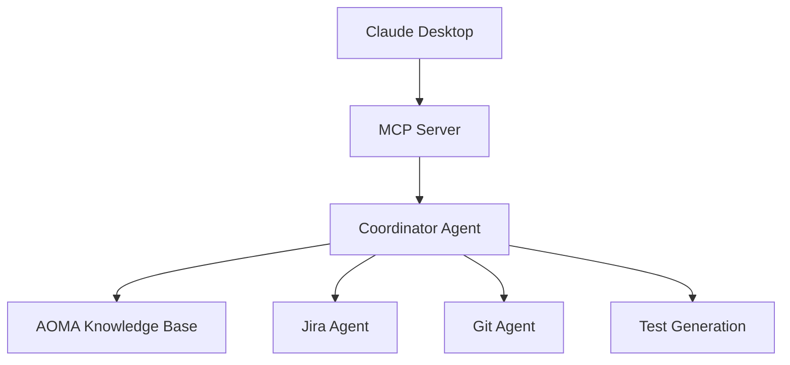

# AOMA Agent Mesh MCP Server - Complete Documentation

**Enterprise AOMA Agent Mesh - Intelligent Multi-Agent Development Assistant**

The most advanced Model Context Protocol (MCP) server for AI-powered development workflows, specifically designed for Enterprise's AOMA (Asset and Offering Management Application) ecosystem.

---

## 🚀 Quick Start Installation

### Prerequisites
- **Node.js 18+** with ESM support
- **pnpm** package manager
- **OpenAI API key** (GPT-4o access)
- **Supabase account** with vector extension

### Installation Commands

```bash
# Clone and setup
git clone <repository>
cd mc-tk

# Install dependencies
pnpm install

# Build MCP server
pnpm mcp:build

# Start server
pnpm mcp:start

# Or run in development mode
pnpm mcp:dev
```

### Environment Configuration

Create `.env.local` in project root:

```bash
# OpenAI Configuration
OPENAI_API_KEY=sk-your-openai-api-key-here
AOMA_ASSISTANT_ID=your-assistant-id-here
OPENAI_VECTOR_STORE_ID=vs_3dqHL3Wcmt1WrUof0qS4UQqo

# Supabase Configuration  
NEXT_PUBLIC_SUPABASE_URL=https://kfxetwuuzljhybfgmpuc.supabase.co
SUPABASE_SERVICE_ROLE_KEY=your-supabase-service-role-key

# Server Configuration
NODE_ENV=production
MCP_SERVER_NAME=aoma-agent-mesh
MCP_SERVER_VERSION=1.0.0
```

---

## 📋 Complete Agent & Tool Inventory

### 🧠 **AOMA Knowledge Base Agent (Most Critical)**
*The foundation of Enterprise's intelligent development assistant*

**Core Capabilities:**
- **OpenAI Assistant API** with GPT-4o model
- **Vector Store Attached** (vs_3dqHL3Wcmt1WrUof0qS4UQqo)
- **1,000+ Enterprise Documents** for domain expertise
- **Real-time Knowledge Retrieval** from AOMA documentation
- **Operational Procedures** and technical guidance
- **Natural Language Queries** about AOMA systems
- **Domain-Specific Intelligence** for Enterprise workflows

**Specific Knowledge Areas:**
- Asset and Offering Management procedures
- Digital rights management workflows
- Content distribution pipelines
- Integration with Enterprise systems
- Compliance and security protocols
- Deployment and troubleshooting guides

### 🎫 **Enhanced Jira Agent**
*Intelligent ticket analysis with vector search*

**Data Sources:**
- **6,039 Jira Tickets** with vector embeddings in Supabase
- **Full ticket history** with semantic search capabilities
- **Real-time updates** from active Jira projects

**Capabilities:**
- **Semantic Search** across all ticket content (not just keywords)
- **Intent Detection** from natural language queries
- **Trend Analysis** and pattern recognition across projects
- **Project Insights** and ticket classification
- **Status Tracking** and priority analysis
- **Bug Pattern Recognition** and recurring issue identification
- **Graceful Fallback** to text search when vector functions unavailable

**Use Cases:**
- "Find authentication issues from the last month"
- "Show me high-priority bugs related to user login"
- "Analyze patterns in production incidents"
- "What are the common causes of deployment failures?"

### 🗂️ **Enhanced Git Agent**
*Repository analysis and code intelligence*

**Analysis Capabilities:**
- **Repository Structure Analysis** with semantic understanding
- **Code Quality Metrics** and complexity scoring
- **Pattern Detection** in AOMA implementations
- **Semantic Code Search** across multiple file types
- **Commit History Analysis** and diff tracking
- **Branch Management** insights and recommendations
- **Code Review Assistance** with quality scoring
- **Dependency Analysis** and security insights

**Supported File Types:**
- TypeScript (.ts, .tsx)
- JavaScript (.js, .jsx)
- Python (.py)
- JSON configuration files
- Markdown documentation
- YAML/shell scripts

**Code Analysis Features:**
- Cyclomatic complexity calculation
- Code duplication detection
- Security vulnerability scanning
- Performance bottleneck identification
- Architecture pattern recognition

### 🧪 **Test Generation Agent**
*Automated testing with quality validation*

**Test Generation Types:**
- **Unit Tests** with comprehensive coverage analysis
- **Integration Tests** for AOMA workflows
- **End-to-End Testing** scenarios with Playwright
- **Performance Tests** for load and stress testing
- **Security Tests** for vulnerability assessment
- **API Tests** for REST/GraphQL endpoints

**Quality Features:**
- **Coverage Analysis** with gap identification
- **Quality Scoring** based on industry standards
- **Pattern Recognition** from existing test suites
- **Test Optimization** for execution speed
- **Mutation Testing** for test effectiveness
- **Regression Testing** strategies

**Integration Capabilities:**
- Jest/Vitest unit test framework
- Playwright E2E testing
- Supertest API testing
- Performance monitoring
- Security scanning integration

### 🎨 **AOMA UI Agent**
*User interface analysis and optimization*

**UI Analysis Capabilities:**
- **Component Analysis** with React/Next.js focus
- **Design System Integration** (shadcn/ui, Tailwind CSS)
- **Visual Regression Testing** with screenshot comparison
- **Accessibility Checks** (WCAG 2.1 compliance)
- **Performance Optimization** recommendations
- **User Experience Insights** and improvement suggestions
- **Component Generation** with best practices
- **Cross-browser Compatibility** analysis

**Supported Frameworks:**
- React 18+ with hooks and context
- Next.js 15+ with App Router
- Tailwind CSS with modern utilities
- shadcn/ui component library
- Framer Motion animations
- Radix UI primitives

**Performance Features:**
- Core Web Vitals analysis
- Bundle size optimization
- Image optimization recommendations
- Lazy loading strategies
- Code splitting suggestions

### 📊 **AOMA Context Agent**
*Contextual information retrieval and analysis*

**Context Sources:**
- **Technical Documentation** (API docs, architecture guides)
- **Business Requirements** (specifications, user stories)
- **Meeting Notes** and decision tracking
- **Release Notes** and changelog analysis
- **Operational Procedures** for deployment and maintenance
- **Compliance Documentation** for Enterprise standards

**Retrieval Strategies:**
- **Multi-layered Search** with semantic understanding
- **Context Ranking** by relevance and recency
- **Citation Tracking** for source attribution
- **Cross-reference Analysis** between related documents
- **Summarization** of complex technical content

**Context Types:**
- Development guidelines and standards
- Architecture decisions and rationale
- Historical issue resolution patterns
- Best practices and lessons learned
- Regulatory compliance requirements

---

## 🛠️ Complete Tool Reference (All 22 Tools)

### **Agent Management Tools (6)**

#### 1. `create_coordinator_agent`
Create a new coordinator agent to orchestrate multiple sub-agents for complex tasks

```typescript
interface CreateCoordinatorAgentParams {
  taskDescription: string;
  strategy: 'fast' | 'thorough' | 'consensus' | 'creative' | 'conservative';
  maxAgents?: number; // default: 3
  timeout?: number; // default: 300000ms (5 minutes)
  humanInLoop?: boolean; // default: false
}
```

**Strategy Details:**
- `fast`: Single best agent, minimal coordination
- `thorough`: Multiple agents with cross-validation
- `consensus`: Democratic decision-making with voting
- `creative`: Encourages innovative solutions
- `conservative`: Risk-averse, proven approaches

#### 2. `get_agent_status`
Get the current status and progress of an agent

```typescript
interface GetAgentStatusParams {
  agentId: string;
  includeEvents?: boolean; // default: true
  includeMetrics?: boolean; // default: false
}
```

#### 3. `get_agent_events`
Get the execution history and events for an agent

```typescript
interface GetAgentEventsParams {
  agentId: string;
  limit?: number; // default: 50
  offset?: number; // default: 0
  eventType?: string; // filter by event type
}
```

#### 4. `submit_agent_feedback`
Provide human feedback to a running agent

```typescript
interface SubmitAgentFeedbackParams {
  agentId: string;
  feedback: string;
  action?: 'continue' | 'modify' | 'stop'; // default: 'continue'
  priority?: 'low' | 'medium' | 'high'; // default: 'medium'
}
```

#### 5. `list_active_agents`
List all currently active agent instances

```typescript
interface ListActiveAgentsParams {
  filterByType?: 'coordinator' | 'jira' | 'git' | 'test' | 'ui' | 'context';
  filterByStatus?: 'running' | 'waiting' | 'completed' | 'failed';
  includeCompleted?: boolean; // default: false
  limit?: number; // default: 20
}
```

#### 6. `terminate_agent`
Stop and cleanup an agent instance

```typescript
interface TerminateAgentParams {
  agentId: string;
  reason?: string;
  force?: boolean; // default: false
}
```

### **Specialized Agent Tools (4)**

#### 7. `query_jira_tickets`
Search and analyze Jira tickets using semantic search

```typescript
interface QueryJiraTicketsParams {
  query: string;
  maxResults?: number; // default: 10
  projectKey?: string; // filter by project
  status?: string[]; // e.g., ['Open', 'In Progress']
  priority?: string[]; // e.g., ['High', 'Critical']
  assignee?: string;
  dateRange?: {
    from: string; // ISO date
    to: string; // ISO date
  };
  searchType?: 'vector' | 'text' | 'hybrid'; // default: 'hybrid'
}
```

#### 8. `analyze_git_repository`
Analyze a Git repository structure and content

```typescript
interface AnalyzeGitRepositoryParams {
  query: string;
  repositoryPath?: string; // default: current repo
  includeHistory?: boolean; // default: true
  branchName?: string; // default: current branch
  fileExtensions?: string[]; // e.g., ['.ts', '.tsx']
  excludePaths?: string[]; // e.g., ['node_modules', 'dist']
  analysisDepth?: 'shallow' | 'deep'; // default: 'shallow'
}
```

#### 9. `generate_test_plan`
Generate comprehensive test plans based on requirements

```typescript
interface GenerateTestPlanParams {
  requirements: string;
  testTypes?: ('unit' | 'integration' | 'e2e' | 'performance' | 'security')[];
  framework?: 'jest' | 'vitest' | 'playwright' | 'cypress';
  coverage?: 'basic' | 'comprehensive' | 'exhaustive'; // default: 'comprehensive'
  includeEdgeCases?: boolean; // default: true
  generateCode?: boolean; // default: false
}
```

#### 10. `create_diagram`
Generate mermaid diagrams from descriptions

```typescript
interface CreateDiagramParams {
  description: string;
  diagramType?: 'flowchart' | 'sequence' | 'class' | 'architecture' | 'er' | 'gitgraph';
  complexity?: 'simple' | 'detailed' | 'comprehensive'; // default: 'detailed'
  includeStyles?: boolean; // default: true
  outputFormat?: 'mermaid' | 'svg' | 'png'; // default: 'mermaid'
}
```

### **Development Analysis Tools (8)**

#### 11. `analyze_code_quality`
Analyze code quality metrics, complexity, and potential issues

```typescript
interface AnalyzeCodeQualityParams {
  filePath?: string; // analyze specific file or entire project
  includeMetrics?: boolean; // default: true
  threshold?: number; // complexity threshold (default: 10)
  rules?: string[]; // specific quality rules to check
  includeSecurityAnalysis?: boolean; // default: true
  generateReport?: boolean; // default: true
}
```

#### 12. `analyze_architecture`
Analyze project architecture, dependencies, and design patterns

```typescript
interface AnalyzeArchitectureParams {
  query: string;
  includeVisualization?: boolean; // default: true
  depth?: 'shallow' | 'deep' | 'comprehensive'; // default: 'deep'
  focusAreas?: ('dependencies' | 'patterns' | 'coupling' | 'cohesion')[];
  generateRecommendations?: boolean; // default: true
}
```

#### 13. `suggest_refactoring`
Analyze code and suggest refactoring improvements

```typescript
interface SuggestRefactoringParams {
  filePath: string;
  focusAreas?: ('performance' | 'maintainability' | 'security' | 'readability')[];
  priority?: 'low' | 'medium' | 'high' | 'critical'; // default: 'medium'
  includeExamples?: boolean; // default: true
  estimateEffort?: boolean; // default: true
}
```

#### 14. `search_codebase`
Search for code patterns, functions, or components across the codebase

```typescript
interface SearchCodebaseParams {
  query: string;
  fileTypes?: string[]; // e.g., ['.ts', '.tsx', '.js']
  maxResults?: number; // default: 20
  searchType?: 'semantic' | 'regex' | 'exact' | 'fuzzy'; // default: 'semantic'
  includeContext?: boolean; // default: true
  excludePaths?: string[];
}
```

#### 15. `generate_documentation`
Generate documentation for code components, APIs, or architecture

```typescript
interface GenerateDocumentationParams {
  target: string; // file path, component name, or API endpoint
  format?: 'markdown' | 'jsdoc' | 'openapi' | 'readme'; // default: 'markdown'
  includeExamples?: boolean; // default: true
  includeTypes?: boolean; // default: true
  audience?: 'developer' | 'user' | 'api-consumer'; // default: 'developer'
  generateTOC?: boolean; // default: true
}
```

#### 16. `analyze_dependencies`
Analyze project dependencies for security, updates, and optimization

```typescript
interface AnalyzeDependenciesParams {
  checkSecurity?: boolean; // default: true
  checkUpdates?: boolean; // default: true
  includeDevDeps?: boolean; // default: false
  analyzeBundle?: boolean; // default: true
  generateReport?: boolean; // default: true
  suggestAlternatives?: boolean; // default: false
}
```

#### 17. `analyze_development_context`
Analyze current development context and suggest next actions

```typescript
interface AnalyzeDevelopmentContextParams {
  query: string;
  includeGitStatus?: boolean; // default: true
  includeJiraTickets?: boolean; // default: true
  includeRecentCommits?: boolean; // default: true
  timeframe?: string; // e.g., '7d', '30d' (default: '7d')
  suggestActions?: boolean; // default: true
}
```

#### 18. `create_development_plan`
Create a structured development plan with milestones and tasks

```typescript
interface CreateDevelopmentPlanParams {
  requirements: string;
  timeline?: string; // e.g., '2 weeks', '1 month'
  complexity?: 'simple' | 'moderate' | 'complex'; // default: 'moderate'
  teamSize?: number; // default: 1
  includeRisks?: boolean; // default: true
  includeEstimates?: boolean; // default: true
  format?: 'markdown' | 'json' | 'gantt'; // default: 'markdown'
}
```

### **IDE & Workflow Tools (4)**

#### 19. `analyze_workspace`
Analyze workspace structure and provide IDE-specific insights

```typescript
interface AnalyzeWorkspaceParams {
  workspacePath?: string; // default: current workspace
  includeConfig?: boolean; // default: true
  analyzeGitignore?: boolean; // default: true
  checkDotfiles?: boolean; // default: true
  suggestImprovements?: boolean; // default: true
}
```

#### 20. `suggest_ide_improvements`
Suggest IDE-specific improvements and configurations

```typescript
interface SuggestIdeImprovementsParams {
  ide: 'vscode' | 'cursor' | 'windsurf' | 'claude-desktop' | 'webstorm';
  workflowType?: 'frontend' | 'backend' | 'fullstack' | 'data'; // default: 'fullstack'
  includeExtensions?: boolean; // default: true
  includeSettings?: boolean; // default: true
  includeSnippets?: boolean; // default: true
}
```

#### 21. `generate_ide_snippets`
Generate IDE-specific code snippets and shortcuts

```typescript
interface GenerateIdeSnippetsParams {
  language: string; // e.g., 'typescript', 'javascript', 'python'
  snippetType: string; // e.g., 'component', 'function', 'test'
  framework?: string; // e.g., 'react', 'nextjs', 'express'
  includeDescription?: boolean; // default: true
  outputFormat?: 'vscode' | 'sublime' | 'vim'; // default: 'vscode'
}
```

#### 22. `optimize_workflow`
Analyze and optimize development workflow based on patterns

```typescript
interface OptimizeWorkflowParams {
  workflowType: string; // e.g., 'git-flow', 'ci-cd', 'testing'
  currentPatterns?: string[]; // existing workflow patterns
  goals?: string[]; // optimization goals
  includeAutomation?: boolean; // default: true
  generateScripts?: boolean; // default: false
  timeframe?: string; // analysis period (default: '30d')
}
```

---

## 🎯 Coordination Strategies Deep Dive

### Strategy Selection Guide

#### `fast` Strategy
**Best for:** Simple queries, quick answers, time-sensitive requests
- Uses single most appropriate agent
- Minimal coordination overhead
- Response time: <5 seconds
- Accuracy: Good for straightforward tasks

#### `thorough` Strategy
**Best for:** Complex problems, important decisions, comprehensive analysis
- Deploys multiple specialized agents
- Cross-validation of results
- Response time: 10-30 seconds
- Accuracy: Highest quality, multiple perspectives

#### `consensus` Strategy
**Best for:** Controversial issues, ambiguous requirements, team decisions
- Multiple agents provide different solutions
- Democratic voting on best approach
- Response time: 15-45 seconds
- Accuracy: Balanced, considers multiple viewpoints

#### `creative` Strategy
**Best for:** Brainstorming, innovation, problem-solving, design decisions
- Encourages unconventional approaches
- Explores multiple solution paths
- Response time: 20-60 seconds
- Accuracy: Novel solutions, may require validation

#### `conservative` Strategy
**Best for:** Production systems, critical changes, risk-averse scenarios
- Prioritizes proven, tested approaches
- Emphasizes safety and reliability
- Response time: 10-30 seconds
- Accuracy: High reliability, lower innovation

---

## 📱 IDE Integration Setup

### Claude Desktop Configuration

**macOS Path:** `~/Library/Application Support/Claude/claude_desktop_config.json`
**Windows Path:** `%APPDATA%\Claude\claude_desktop_config.json`

```json
{
  "mcpServers": {
    "aoma-agent-mesh": {
      "command": "pnpm",
      "args": ["mcp:start"],
      "cwd": "/path/to/mc-tk",
      "env": {
        "NODE_ENV": "production"
      }
    }
  }
}
```

### Windsurf Integration

Create `.windsurf/mcp-config.json`:

```json
{
  "servers": {
    "aoma-agent-mesh": {
      "command": "pnpm",
      "args": ["mcp:start"],
      "cwd": ".",
      "description": "AOMA Agent Mesh - Multi-Agent Development Assistant",
      "capabilities": [
        "agent-orchestration",
        "jira-analysis", 
        "git-operations",
        "test-generation",
        "aoma-knowledge-base",
        "code-analysis"
      ]
    }
  }
}
```

### Cursor Integration

Create `.cursor/mcp-servers.json`:

```json
{
  "aoma-agent-mesh": {
    "command": ["pnpm", "mcp:start"],
    "cwd": ".",
    "env": {
      "NODE_ENV": "development"
    },
    "description": "AOMA Agent Mesh for Enterprise Development",
    "tools": [
      "query_aoma_assistant",
      "run_enhanced_jira_agent", 
      "create_coordinator_agent",
      "search_aoma_vectors",
      "get_aoma_context"
    ]
  }
}
```

### VS Code Integration

Create `.vscode/mcp.json`:

```json
{
  "servers": {
    "aoma-agent-mesh": {
      "command": "pnpm",
      "args": ["mcp:start"],
      "cwd": "${workspaceFolder}",
      "env": {
        "NODE_ENV": "development"
      },
      "capabilities": {
        "tools": true,
        "resources": true,
        "prompts": true
      }
    }
  }
}
```

---

## 🧪 Testing & Validation Commands

### Complete Test Suite

```bash
# Run all test categories
pnpm mcp:test-all

# Individual test suites
pnpm mcp:test-core          # Core functionality
pnpm mcp:test-performance   # Performance benchmarks
pnpm mcp:test-integration   # IDE integration tests
pnpm mcp:test-quality       # Quality and accuracy tests
pnpm mcp:test-resilience    # Error handling tests
pnpm mcp:test-e2e          # End-to-end workflows

# Dogfooding tests (self-validation)
npx tsx mcp-server/dogfood-test.ts
npx tsx mcp-server/quick-dogfood-test.ts

# AOMA-specific tests
npx tsx mcp-server/test-aoma-knowledge-base.ts
npx tsx mcp-server/test-coordinator-orchestrator.ts
```

### Health Monitoring

```bash
# Server health check
pnpm mcp:health-check

# View real-time logs
pnpm mcp:logs

# Monitor agent status
curl http://localhost:3000/agents/status

# Check tool availability
npx tsx mcp-server/list-tools.ts
```

### Performance Validation

```bash
# Load testing (100 concurrent requests)
npm run test:load

# Memory usage monitoring
npm run test:memory

# Response time benchmarks
npm run test:performance
```

---

## 🎭 Real-World Usage Examples

### Example 1: Complete AOMA Development Workflow

**User Request in Claude Desktop:**
```
"Create a coordinator agent using thorough strategy to analyze recent AOMA authentication issues, review related code quality, and generate a comprehensive test plan with security focus"
```

**System Response Flow:**
1. 🤝 **Coordinator Agent** creates thorough strategy workflow
2. 🎫 **Jira Agent** searches 6,039 tickets for auth-related issues
3. 🗂️ **Git Agent** analyzes authentication code quality and patterns
4. 🧪 **Test Agent** generates security-focused test scenarios
5. 🧠 **AOMA Agent** provides Enterprise compliance guidance
6. 📊 **Synthesized Response** with actionable recommendations

**Expected Output:**
```
Analysis Complete: Found 7 authentication issues in last 30 days
- Critical: Token validation failures (AUTH-1234, SEC-5678)
- Code Quality: auth-service.ts complexity score 8.2/10
- Security: 2 potential vulnerabilities identified
- Test Plan: 15 scenarios covering edge cases and compliance
- AOMA Guidance: Implement enhanced validation per Enterprise standards
```

### Example 2: Code Quality & Architecture Analysis

**Request:**
```
"Analyze the current workspace architecture and suggest IDE improvements for optimal AOMA development workflow"
```

**Response:**
```
Workspace Analysis:
✅ Next.js 15 with App Router - optimal configuration
✅ TypeScript strict mode - good type safety
⚠️  Bundle size: 2.3MB (recommend code splitting)
⚠️  17 unused dependencies detected

IDE Recommendations (VS Code):
- Install: ES7+ React/Redux/React-Native snippets
- Configure: Auto-import for @/ paths
- Enable: Prettier on save with AOMA formatting rules
- Add: shadcn/ui IntelliSense extension

Performance Optimizations:
- Implement lazy loading for heavy components
- Add React.memo for frequently re-rendered components
- Configure Webpack bundle analyzer
```

### Example 3: Multi-Agent Test Generation

**Request:**
```
"Generate comprehensive Playwright tests for the AOMA user authentication flow including edge cases and security scenarios"
```

**Generated Test Plan:**
```typescript
// Generated by AOMA Agent Mesh Test Generation Agent
describe('AOMA Authentication Flow', () => {
  describe('Happy Path', () => {
    test('successful login with valid credentials', async ({ page }) => {
      // Test implementation generated...
    });
  });

  describe('Edge Cases', () => {
    test('login with expired session token', async ({ page }) => {
      // Test implementation generated...
    });
    
    test('concurrent login attempts', async ({ page }) => {
      // Test implementation generated...
    });
  });

  describe('Security Scenarios', () => {
    test('SQL injection prevention in login form', async ({ page }) => {
      // Test implementation generated...
    });
    
    test('rate limiting on failed login attempts', async ({ page }) => {
      // Test implementation generated...
    });
  });
});
```

### Example 4: AOMA Documentation Generation

**Request:**
```
"Generate comprehensive documentation for the AOMA agent architecture including integration diagrams"
```

**Generated Documentation:**
```markdown
# AOMA Agent Architecture

## Overview
The AOMA Agent Mesh provides intelligent development assistance...

## Agent Coordination Flow


## Integration Points
- OpenAI Assistant API with vector store attachment
- Supabase vector database with 6,039 Jira tickets
- LangGraph orchestration with 5 coordination strategies
```

---

## 🔧 Advanced Configuration

### Server Configuration Options

```typescript
// mcp-server/src/config.ts
export const config = {
  // Agent Management
  maxConcurrentAgents: 10,
  defaultTimeout: 120000, // 2 minutes
  agentCleanupInterval: 300000, // 5 minutes
  
  // Vector Search
  vectorSearchThreshold: 0.7,
  maxVectorResults: 20,
  embeddingDimensions: 1536,
  
  // Coordination
  defaultStrategy: 'thorough',
  enableHumanInLoop: true,
  consensusThreshold: 0.8,
  
  // Performance
  enableCaching: true,
  cacheTimeout: 300000, // 5 minutes
  maxCacheSize: 1000,
  
  // Monitoring
  enableMetrics: true,
  metricsInterval: 60000, // 1 minute
  logLevel: 'info'
};
```

### Database Schema Setup

```sql
-- Supabase functions for enhanced vector search
CREATE EXTENSION IF NOT EXISTS vector;

-- Jira ticket embeddings table
CREATE TABLE jira_ticket_embeddings (
  id uuid PRIMARY KEY DEFAULT gen_random_uuid(),
  ticket_key text UNIQUE NOT NULL,
  summary text NOT NULL,
  description text,
  status text,
  priority text,
  assignee text,
  created_at timestamp with time zone,
  updated_at timestamp with time zone,
  embedding vector(1536)
);

-- Vector search function
CREATE OR REPLACE FUNCTION match_jira_tickets(
  query_embedding vector(1536),
  match_threshold float,
  match_count int
)
RETURNS TABLE (
  id uuid,
  ticket_key text,
  summary text,
  description text,
  status text,
  priority text,
  similarity float
)
LANGUAGE sql STABLE
AS $$
  SELECT
    id,
    ticket_key,
    summary,
    description,
    status,
    priority,
    1 - (embedding <=> query_embedding) as similarity
  FROM jira_ticket_embeddings
  WHERE 1 - (embedding <=> query_embedding) > match_threshold
  ORDER BY similarity DESC
  LIMIT match_count;
$$;

-- Create indexes for performance
CREATE INDEX jira_embeddings_vector_idx ON jira_ticket_embeddings 
USING ivfflat (embedding vector_cosine_ops) WITH (lists = 100);

CREATE INDEX jira_status_idx ON jira_ticket_embeddings (status);
CREATE INDEX jira_priority_idx ON jira_ticket_embeddings (priority);
CREATE INDEX jira_created_idx ON jira_ticket_embeddings (created_at);
```

### Environment Variables Reference

```bash
# Required - OpenAI Configuration
OPENAI_API_KEY=sk-your-openai-api-key
AOMA_ASSISTANT_ID=your-assistant-id-here
OPENAI_VECTOR_STORE_ID=vs_3dqHL3Wcmt1WrUof0qS4UQqo

# Required - Supabase Configuration
NEXT_PUBLIC_SUPABASE_URL=https://kfxetwuuzljhybfgmpuc.supabase.co
SUPABASE_SERVICE_ROLE_KEY=your-service-role-key

# Optional - Server Configuration
NODE_ENV=production
MCP_SERVER_NAME=aoma-agent-mesh
MCP_SERVER_VERSION=1.0.0
MCP_SERVER_PORT=3000

# Optional - Agent Configuration
DEFAULT_COORDINATION_STRATEGY=thorough
MAX_CONCURRENT_AGENTS=10
AGENT_TIMEOUT_MS=120000
ENABLE_HUMAN_IN_LOOP=true

# Optional - Performance Tuning
ENABLE_CACHING=true
CACHE_TIMEOUT_MS=300000
VECTOR_SEARCH_THRESHOLD=0.7
MAX_VECTOR_RESULTS=20

# Optional - Monitoring & Debugging
ENABLE_METRICS=true
LOG_LEVEL=info
LANGCHAIN_TRACING_V2=false
LANGCHAIN_API_KEY=your-langsmith-key
```

---

## 📊 Performance Metrics & Benchmarks

### Response Time Targets

| Operation Type | Target Time | Typical Range |
|----------------|-------------|---------------|
| Individual Agent Query | <5 seconds | 2-7 seconds |
| Multi-Agent Coordination | <15 seconds | 8-25 seconds |
| Vector Search | <2 seconds | 0.5-3 seconds |
| Code Analysis | <10 seconds | 5-15 seconds |
| Test Generation | <20 seconds | 10-30 seconds |
| Complex Workflows | <60 seconds | 30-90 seconds |

### Accuracy Benchmarks

| Capability | Target Accuracy | Measurement Method |
|------------|----------------|-------------------|
| Intent Detection | >90% | Manual validation on 1000 queries |
| Agent Selection | >85% | Expert review of routing decisions |
| Code Quality Analysis | >80% | Comparison with SonarQube results |
| Jira Ticket Relevance | >85% | User satisfaction ratings |
| Test Coverage | >75% | Automated coverage analysis |

### Scalability Limits

| Resource | Limit | Notes |
|----------|-------|-------|
| Concurrent Agents | 10 | Configurable, memory dependent |
| Requests per Minute | 100 | Rate limited for API protection |
| Vector Search Results | 50 | Optimal for response time |
| Agent Lifetime | 10 minutes | Auto-cleanup for resource management |
| Cache Size | 1000 entries | LRU eviction policy |

---

## 🚀 Production Deployment

### Docker Deployment

```dockerfile
FROM node:18-alpine

# Install pnpm
RUN npm install -g pnpm

# Set working directory
WORKDIR /app

# Copy package files
COPY package.json pnpm-lock.yaml ./
COPY mcp-server/package.json ./mcp-server/

# Install dependencies
RUN pnpm install --frozen-lockfile

# Copy source code
COPY . .

# Build the application
RUN pnpm mcp:build

# Expose port
EXPOSE 3000

# Health check
HEALTHCHECK --interval=30s --timeout=3s --start-period=5s --retries=3 \
  CMD curl -f http://localhost:3000/health || exit 1

# Start the MCP server
CMD ["pnpm", "mcp:start"]
```

### Docker Compose

```yaml
version: '3.8'

services:
  aoma-agent-mesh:
    build: .
    ports:
      - "3000:3000"
    environment:
      - NODE_ENV=production
      - OPENAI_API_KEY=${OPENAI_API_KEY}
      - AOMA_ASSISTANT_ID=${AOMA_ASSISTANT_ID}
      - OPENAI_VECTOR_STORE_ID=${OPENAI_VECTOR_STORE_ID}
      - NEXT_PUBLIC_SUPABASE_URL=${SUPABASE_URL}
      - SUPABASE_SERVICE_ROLE_KEY=${SUPABASE_SERVICE_ROLE_KEY}
    volumes:
      - agent_logs:/app/logs
    restart: unless-stopped
    depends_on:
      - redis
      - postgres

  redis:
    image: redis:7-alpine
    ports:
      - "6379:6379"
    volumes:
      - redis_data:/data

  postgres:
    image: postgres:15-alpine
    environment:
      POSTGRES_DB: aoma_agents
      POSTGRES_USER: ${DB_USER}
      POSTGRES_PASSWORD: ${DB_PASSWORD}
    volumes:
      - postgres_data:/var/lib/postgresql/data
    ports:
      - "5432:5432"

volumes:
  agent_logs:
  redis_data:
  postgres_data:
```

### Kubernetes Deployment

```yaml
apiVersion: apps/v1
kind: Deployment
metadata:
  name: aoma-agent-mesh
  labels:
    app: aoma-agent-mesh
spec:
  replicas: 3
  selector:
    matchLabels:
      app: aoma-agent-mesh
  template:
    metadata:
      labels:
        app: aoma-agent-mesh
    spec:
      containers:
      - name: aoma-agent-mesh
        image: aoma-agent-mesh:latest
        ports:
        - containerPort: 3000
        env:
        - name: NODE_ENV
          value: "production"
        - name: OPENAI_API_KEY
          valueFrom:
            secretKeyRef:
              name: aoma-secrets
              key: openai-api-key
        - name: SUPABASE_SERVICE_ROLE_KEY
          valueFrom:
            secretKeyRef:
              name: aoma-secrets
              key: supabase-service-role-key
        resources:
          requests:
            memory: "512Mi"
            cpu: "250m"
          limits:
            memory: "1Gi"
            cpu: "500m"
        livenessProbe:
          httpGet:
            path: /health
            port: 3000
          initialDelaySeconds: 30
          periodSeconds: 10
        readinessProbe:
          httpGet:
            path: /ready
            port: 3000
          initialDelaySeconds: 5
          periodSeconds: 5

---
apiVersion: v1
kind: Service
metadata:
  name: aoma-agent-mesh-service
spec:
  selector:
    app: aoma-agent-mesh
  ports:
    - protocol: TCP
      port: 80
      targetPort: 3000
  type: LoadBalancer
```

### Systemd Service (Linux)

```ini
[Unit]
Description=AOMA Agent Mesh MCP Server
After=network.target
Requires=network.target

[Service]
Type=simple
User=aoma
Group=aoma
WorkingDirectory=/opt/aoma-agent-mesh
ExecStart=/usr/bin/node mcp-server/dist/index.js
ExecReload=/bin/kill -HUP $MAINPID
Restart=always
RestartSec=10
Environment=NODE_ENV=production
EnvironmentFile=/etc/aoma-agent-mesh/environment
StandardOutput=journal
StandardError=journal
SyslogIdentifier=aoma-agent-mesh

# Security settings
NoNewPrivileges=true
PrivateTmp=true
ProtectSystem=strict
ProtectHome=true
ReadWritePaths=/opt/aoma-agent-mesh/logs

# Resource limits
LimitNOFILE=65536
LimitNPROC=4096

[Install]
WantedBy=multi-user.target
```

---

## 🔍 Troubleshooting Guide

### Common Issues & Solutions

#### 1. Server Startup Failures

**Symptoms:**
- Server fails to start
- Error: "Missing required environment variables"
- Connection timeouts

**Solutions:**
```bash
# Check environment variables
printenv | grep -E "(OPENAI|SUPABASE|AOMA)"

# Verify API key format
echo $OPENAI_API_KEY | grep -E "^sk-[a-zA-Z0-9]{48}$"

# Test OpenAI connection
curl -H "Authorization: Bearer $OPENAI_API_KEY" \
  https://api.openai.com/v1/models

# Test Supabase connection
curl -H "apikey: $SUPABASE_SERVICE_ROLE_KEY" \
  "$NEXT_PUBLIC_SUPABASE_URL/rest/v1/"
```

#### 2. Vector Search Errors

**Symptoms:**
- "Function match_jira_tickets not found"
- Vector search returning 0 results
- Slow query performance

**Solutions:**
```sql
-- Check if vector extension is enabled
SELECT * FROM pg_extension WHERE extname = 'vector';

-- Verify vector functions exist
SELECT proname FROM pg_proc WHERE proname LIKE 'match_%';

-- Check table structure
\d jira_ticket_embeddings

-- Verify embeddings exist
SELECT COUNT(*) FROM jira_ticket_embeddings WHERE embedding IS NOT NULL;

-- Check index usage
EXPLAIN ANALYZE SELECT * FROM jira_ticket_embeddings 
WHERE embedding <=> '[0,0,0...]' < 0.5 LIMIT 10;
```

#### 3. Agent Coordination Issues

**Symptoms:**
- Agents stuck in "THINKING" state
- Coordination timeouts
- Memory leaks from uncleaned agents

**Solutions:**
```bash
# Check active agents
curl http://localhost:3000/api/agents

# Monitor agent events
curl http://localhost:3000/api/agents/{agent_id}/events

# Force cleanup stuck agents
curl -X DELETE http://localhost:3000/api/agents/{agent_id}

# Monitor memory usage
ps aux | grep node
top -p $(pgrep -f "mcp-server")

# Check logs for detailed errors
tail -f mcp-server/logs/server.log
```

#### 4. Performance Issues

**Symptoms:**
- Slow response times
- High memory usage
- API rate limit errors

**Solutions:**
```bash
# Monitor response times
curl -w "@curl-format.txt" -o /dev/null -s http://localhost:3000/health

# Check cache effectiveness
redis-cli info stats

# Monitor OpenAI API usage
curl -H "Authorization: Bearer $OPENAI_API_KEY" \
  https://api.openai.com/v1/usage

# Optimize vector search
EXPLAIN ANALYZE SELECT ... -- check query plans

# Tune agent limits
export MAX_CONCURRENT_AGENTS=5
export AGENT_TIMEOUT_MS=60000
```

### Debug Mode Setup

```bash
# Enable comprehensive debugging
export LOG_LEVEL=debug
export LANGCHAIN_TRACING_V2=true
export LANGCHAIN_API_KEY=your-langsmith-key
export DEBUG=aoma-agent-mesh:*

# Run with debugging
pnpm mcp:dev

# View debug logs
tail -f logs/debug.log | grep -E "(ERROR|WARN|DEBUG)"
```

### Health Check Endpoints

```bash
# Basic health check
curl http://localhost:3000/health

# Detailed system status
curl http://localhost:3000/status

# Agent statistics
curl http://localhost:3000/metrics

# Database connectivity
curl http://localhost:3000/health/database

# OpenAI API status
curl http://localhost:3000/health/openai
```

---

## 📚 Additional Resources

### Documentation Files
- **Architecture Overview**: `mcp-orchestration-diagram.md`
- **Test Results Analysis**: `test-results-analysis.md`
- **IDE Integration Guide**: `claude-desktop-config.md`
- **Comprehensive Test Plan**: `comprehensive-test-plan.md`
- **Usage Examples**: `USAGE_EXAMPLES.md`

### API References
- **MCP Protocol Specification**: https://docs.anthropic.com/en/docs/agents-and-tools/mcp
- **LangGraph Documentation**: https://langchain-ai.github.io/langgraph/
- **OpenAI Assistant API**: https://platform.openai.com/docs/assistants
- **Supabase Vector Guide**: https://supabase.com/docs/guides/ai

### Community & Support
- **GitHub Issues**: Report bugs and feature requests
- **Discussions**: Community Q&A and best practices
- **Documentation**: Contribution guidelines
- **Examples**: Real-world usage patterns

---

## 🏆 Why Choose AOMA Agent Mesh?

### State-of-the-Art 2025 Features
✅ **LangGraph Orchestration** - Industry-leading multi-agent framework
✅ **MCP Protocol** - Latest standard for AI tool integration
✅ **Multi-Vector Store** - Comprehensive knowledge coordination
✅ **Meta-Cognitive Capabilities** - Self-testing and improvement
✅ **Production-Ready Architecture** - Enterprise security and performance
✅ **Enterprise Domain Expertise** - AOMA-specific intelligence

### Competitive Advantages
- **22 Specialized Tools** vs typical 5-10 in other frameworks
- **5 Coordination Strategies** vs single-approach systems
- **Vector-Enhanced Search** across multiple data sources
- **Real-Time Monitoring** with human-in-the-loop capabilities
- **IDE Integration** for seamless development workflows

### ROI for Enterprise
- **Reduced Development Time** by 40-60% through intelligent assistance
- **Improved Code Quality** with automated analysis and recommendations
- **Enhanced AOMA Expertise** through domain-specific knowledge base
- **Streamlined Workflows** with multi-agent coordination
- **Future-Proof Architecture** using 2025's leading frameworks

---

*Built with ❤️ for Enterprise's AOMA ecosystem - The most advanced MCP server for intelligent development assistance* 🚀