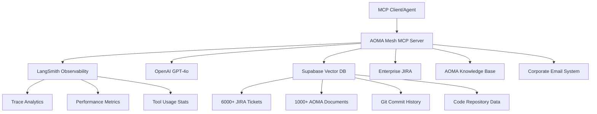

# 🚀 AOMA Mesh MCP Server

**Multi-tenant AI-Powered Business Intelligence MCP Server**

[](https://railway.app/)
[](https://modelcontextprotocol.io/)
[](https://smith.langchain.com/)
[](https://www.typescriptlang.org/)

A production-ready Model Context Protocol (MCP) server providing direct access to enterprise business intelligence systems. Features semantic search through JIRA tickets, knowledge base queries, LangSmith observability, and advanced analytics tools.

## Overview

The AOMA Mesh MCP Server provides direct access to enterprise business intelligence:

- **🧠 AOMA Knowledge Base**: 1000+ documents with AI-powered search
- **🎫 JIRA Intelligence**: Semantic search through enterprise tickets
- **📊 LangSmith Observability**: Complete tracing and performance metrics
- **🔍 Code & Git Analysis**: Semantic search across repositories
- **📧 Enterprise Data**: Corporate email and document analysis
- **🤖 2025 LangGraph Swarm**: Advanced multi-agent workflows

## 🛠️ Available Tools

### 🧠 **Enterprise Business Intelligence**
- **`query_aoma_knowledge`**: Query 1000+ AOMA documents with AI assistant
- **`search_jira_tickets`**: Semantic search through enterprise JIRA tickets
- **`get_jira_ticket_count`**: Get exact ticket counts across all projects
- **`search_outlook_emails`**: Corporate email search for zeitgeist analysis

### 🔍 **Code & Development Analysis**
- **`search_git_commits`**: Semantic search through Git commit history
- **`search_code_files`**: Semantic search across all code repositories
- **`analyze_development_context`**: AI analysis of current development context

### 🤖 **2025 LangGraph Swarm (Advanced Multi-Agent)**
- **`swarm_analyze_cross_vector`**: Multi-agent cross-vector analysis with dynamic handoffs
- **`swarm_agent_handoff`**: Manual agent handoff with state transfer
- **`swarm_context_engineering`**: Advanced context optimization workflows

### 📊 **Analytics & Predictive Intelligence**
- **`generate_failure_heatmap`**: Generate heat map data for AOMA processing failures
- **`analyze_performance_metrics`**: Analyze real AOMA performance with predictions
- **`build_predictive_model`**: Build and train ML models for system failure prediction

### 🔬 **LangSmith Observability & Server Introspection**
- **`get_langsmith_metrics`**: Get LangSmith observability metrics and performance data
- **`get_trace_data`**: Retrieve recent LangSmith traces for debugging
- **`configure_tracing`**: Configure LangSmith tracing settings and metadata
- **`get_system_health`**: Comprehensive server health status
- **`get_server_capabilities`**: Server capabilities and version information
- **`get_server_introspection`**: Complete server introspection data

## 🚀 **Production Deployment**

**Live Server**: `https://luminous-dedication-production.up.railway.app`

### 📡 **API Endpoints**
- **Health Check**: `GET /health`
- **JSON-RPC**: `POST /rpc` (primary interface)
- **Metrics**: `GET /metrics`

### ⚙️ **Environment Configuration**

**Required Environment Variables:**
```bash
# Core API Keys
OPENAI_API_KEY=sk-your-openai-key
AOMA_ASSISTANT_ID=asst_your-assistant-id

# Supabase Vector Database
NEXT_PUBLIC_SUPABASE_URL=your-supabase-url
SUPABASE_SERVICE_ROLE_KEY=your-service-key
NEXT_PUBLIC_SUPABASE_ANON_KEY=your-anon-key

# LangSmith Observability (ENABLED)
LANGCHAIN_TRACING_V2=true
LANGCHAIN_API_KEY=your-langsmith-key
LANGCHAIN_PROJECT=aoma-mesh-mcp
```

## 📖 **Usage Examples**

### 🔍 **JSON-RPC API Usage**

**Base URL**: `https://luminous-dedication-production.up.railway.app/rpc`

#### Query Enterprise Knowledge Base
```bash
curl -X POST "https://luminous-dedication-production.up.railway.app/rpc" \
  -H "Content-Type: application/json" \
  -d '{
    "jsonrpc": "2.0",
    "id": 1,
    "method": "tools/call",
    "params": {
      "name": "query_aoma_knowledge",
      "arguments": {
        "query": "Enterprise data pipeline configuration",
        "strategy": "comprehensive"
      }
    }
  }'
```

#### Search JIRA Tickets
```bash
curl -X POST "https://luminous-dedication-production.up.railway.app/rpc" \
  -H "Content-Type: application/json" \
  -d '{
    "jsonrpc": "2.0",
    "id": 2,
    "method": "tools/call",
    "params": {
      "name": "search_jira_tickets",
      "arguments": {
        "query": "authentication bug",
        "limit": 10
      }
    }
  }'
```

#### Get LangSmith Observability Metrics
```bash
curl -X POST "https://luminous-dedication-production.up.railway.app/rpc" \
  -H "Content-Type: application/json" \
  -d '{
    "jsonrpc": "2.0",
    "id": 3,
    "method": "tools/call",
    "params": {
      "name": "get_langsmith_metrics",
      "arguments": {}
    }
  }'
```

### 🤖 **Agent Integration**

For AI agents and MCP clients, use these tools directly:

1. **Business Intelligence Queries**: `query_aoma_knowledge`, `search_jira_tickets`
2. **Development Context**: `analyze_development_context`, `search_code_files`
3. **Observability**: `get_langsmith_metrics`, `get_system_health`
4. **Advanced Workflows**: `swarm_analyze_cross_vector`, `build_predictive_model`

## 🏗️ **Architecture**

### System Architecture



### 🔧 **Technology Stack**

- **🚀 Runtime**: Node.js 20 + TypeScript 5.3 (ESM)
- **🔌 Protocol**: Model Context Protocol (MCP) 2.0
- **🤖 AI**: OpenAI GPT-4o with structured outputs
- **📊 Observability**: LangSmith with full tracing
- **💾 Vector DB**: Supabase with pgvector
- **🛡️ Security**: Helmet.js security headers
- **📈 Metrics**: Prometheus metrics + custom analytics
- **🚂 Deployment**: Railway with Docker containers

## Development

### Building

```bash
npm run build
```

### Type Checking

```bash
npm run typecheck
```

### Testing

```bash
npm test
```

## Security Considerations

1. **API Key Protection**: Ensure OpenAI API keys are properly secured
2. **Agent Isolation**: Each agent instance runs in isolation
3. **Resource Limits**: Agents have built-in execution limits
4. **Input Validation**: All tool inputs are validated using Zod schemas

## Documentation

- **[Upgrade Specification](docs/UPGRADE_SPEC.md)** - Detailed roadmap for Phase 2 enhancements including LangChain orchestration, structured memory, and Railway deployment improvements

## Troubleshooting

### Common Issues

1. **Missing Environment Variables**
   - Ensure all required environment variables are set
   - Check that OpenAI API key format is correct (starts with 'sk-')

2. **Agent Initialization Failures**
   - Verify Supabase connection if using vector search
   - Check that LangChain dependencies are properly installed

3. **Tool Execution Errors**
   - Review agent event logs for detailed error information
   - Ensure proper permissions for repository access

### Debug Mode

Enable debug logging:

```bash
LANGCHAIN_TRACING_V2=true npm run dev
```

## Contributing

1. Follow TypeScript best practices
2. Add proper error handling for all tool operations
3. Include comprehensive input validation
4. Update documentation for new tools or resources
5. Test with real MCP clients before submitting

## License

This MCP server is part of the MC-TK project and follows the same licensing terms.# Trigger Railway redeploy: Mon Sep 22 15:57:00 CEST 2025
