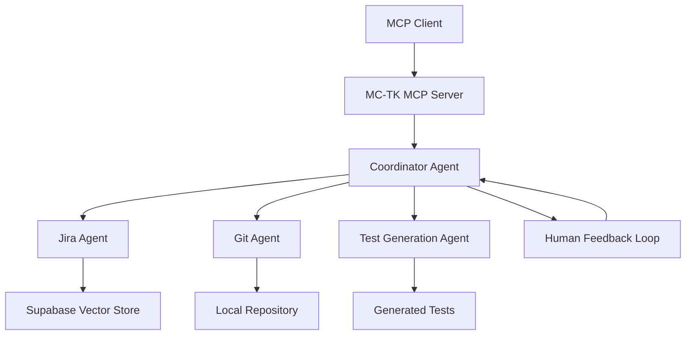

# 🚀 AOMA Mesh MCP Server

**Sony Music's AI-Powered Development Assistant with Business Intelligence**

[](https://aws.amazon.com/lambda/)
[](https://modelcontextprotocol.io/)
[](https://www.typescriptlang.org/)

A state-of-the-art Model Context Protocol (MCP) server that provides AI-powered development assistance with real Sony Music business intelligence. Features semantic search through JIRA tickets, AOMA knowledge base queries, and comprehensive development tools.

## Overview

The MC-TK Agent MCP Server provides access to:

- **Coordinator Agent**: Orchestrates multiple sub-agents for complex tasks
- **Jira Agent**: Semantic search and analysis of Jira tickets
- **Git Agent**: Repository analysis and code search
- **Test Generation Agent**: Automated test plan and code generation
- **Diagram Generation**: Create mermaid diagrams from natural language

## Features

### Tools Available

1. **Agent Management**
   - `create_coordinator_agent`: Create and start a new coordinator agent
   - `get_agent_status`: Check agent execution status
   - `get_agent_events`: View agent execution history
   - `submit_agent_feedback`: Provide human feedback to running agents
   - `list_active_agents`: List all active agent instances
   - `terminate_agent`: Stop and cleanup agents

2. **Specialized Agent Operations**
   - `query_jira_tickets`: Semantic search through Jira knowledge base
   - `analyze_git_repository`: Analyze repository structure and content
   - `generate_test_plan`: Create comprehensive test plans
   - `create_diagram`: Generate mermaid diagrams

3. **Enhanced Development Tools**
   - `analyze_code_quality`: Analyze code quality metrics, complexity, and potential issues
   - `analyze_architecture`: Analyze project architecture, dependencies, and design patterns
   - `suggest_refactoring`: Analyze code and suggest refactoring improvements
   - `search_codebase`: Search for code patterns, functions, or components across the codebase
   - `generate_documentation`: Generate documentation for code components, APIs, or architecture
   - `analyze_dependencies`: Analyze project dependencies for security, updates, and optimization

4. **IDE-Specific Integration Tools**
   - `analyze_workspace`: Analyze workspace structure and provide IDE-specific insights
   - `suggest_ide_improvements`: Suggest IDE-specific improvements and configurations
   - `generate_ide_snippets`: Generate IDE-specific code snippets and shortcuts
   - `analyze_development_context`: Analyze current development context and suggest next actions
   - `optimize_workflow`: Analyze and optimize development workflow based on patterns
   - `create_development_plan`: Create a structured development plan with milestones and tasks

### Resources Available

1. **Agent Instances**: Real-time status of all active agents
2. **Agent Types**: Information about available agent capabilities
3. **Agent Events**: Detailed execution history for each agent
4. **Agent Status**: Current state and progress information

## Installation

1. **Prerequisites**
   - Node.js 18+ with ESM support
   - Access to the MC-TK project environment
   - Valid OpenAI API key

2. **Setup**
   ```bash
   cd mcp-server
   npm install
   npm run build
   ```

3. **Environment Variables**
   ```bash
   # Required
   OPENAI_API_KEY=sk-your-openai-key

   # Optional
   OPENAI_MODEL_NAME=gpt-4o
   NEXT_PUBLIC_SUPABASE_URL=your-supabase-url
   SUPABASE_SERVICE_ROLE_KEY=your-supabase-key
   LANGCHAIN_TRACING_V2=false
   ```

## Usage

### Running the Server

```bash
# Development mode
npm run dev

# Production mode
npm run start
```

### MCP Client Configuration

Add to your MCP client configuration:

```json
{
  "servers": {
    "mc-tk-agents": {
      "command": "node",
      "args": ["/path/to/mc-tk/mcp-server/dist/index.js"],
      "env": {
        "OPENAI_API_KEY": "sk-your-key"
      }
    }
  }
}
```

### Example Usage in Claude Desktop

1. **Create a Coordinator Agent**
   ```
   Please create a coordinator agent to analyze the repository and generate test plans for the authentication system.
   ```

2. **Query Jira Tickets**
   ```
   Search for Jira tickets related to authentication bugs or login issues.
   ```

3. **Analyze Repository**
   ```
   Analyze the current repository structure and identify all authentication-related files.
   ```

4. **Generate Test Plan**
   ```
   Generate a comprehensive Playwright test plan for the user login workflow.
   ```

5. **Create Diagram**
   ```
   Create a flowchart showing the authentication workflow from login to dashboard.
   ```

## Architecture

### Agent Coordination Flow



### Tool Integration

The MCP server integrates with the existing MC-TK agent infrastructure:

- **Agent Service**: Manages agent lifecycle and state
- **LangGraph Workflows**: Executes agent decision-making processes
- **Vector Stores**: Provides semantic search capabilities
- **OpenAI Integration**: Powers LLM reasoning and tool usage

## Development

### Building

```bash
npm run build
```

### Type Checking

```bash
npm run typecheck
```

### Testing

```bash
npm test
```

## Security Considerations

1. **API Key Protection**: Ensure OpenAI API keys are properly secured
2. **Agent Isolation**: Each agent instance runs in isolation
3. **Resource Limits**: Agents have built-in execution limits
4. **Input Validation**: All tool inputs are validated using Zod schemas

## Troubleshooting

### Common Issues

1. **Missing Environment Variables**
   - Ensure all required environment variables are set
   - Check that OpenAI API key format is correct (starts with 'sk-')

2. **Agent Initialization Failures**
   - Verify Supabase connection if using vector search
   - Check that LangChain dependencies are properly installed

3. **Tool Execution Errors**
   - Review agent event logs for detailed error information
   - Ensure proper permissions for repository access

### Debug Mode

Enable debug logging:

```bash
LANGCHAIN_TRACING_V2=true npm run dev
```

## Contributing

1. Follow TypeScript best practices
2. Add proper error handling for all tool operations
3. Include comprehensive input validation
4. Update documentation for new tools or resources
5. Test with real MCP clients before submitting

## License

This MCP server is part of the MC-TK project and follows the same licensing terms.