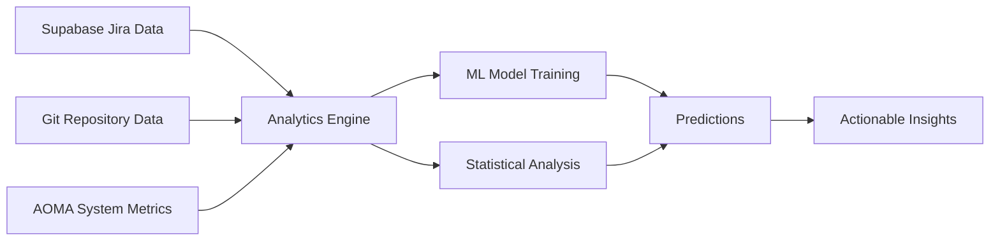

# AOMA Mesh MCP Enhancement Specification
*Transforming from "How to" responses to "Actually doing" responses*

---

## 🎯 **Problem Analysis**

### **Current State:**
- AOMA Mesh provides **methodological guidance** ("Here's how to create a model...")
- Responds with **instructions** rather than **execution**
- Acts as a **consultant** rather than a **data scientist**

### **Desired State:**
- AOMA Mesh **actually creates** the predictive model
- Provides **executable analysis** with real data
- Acts as an **intelligent agent** that performs work

---

## 🔧 **Enhancement Roadmap**

### **Phase 1: Data Integration & Analysis Engine**

#### **1.1 Enhanced Data Connectors**
```typescript
// New tool: data_analysis_engine
interface DataAnalysisRequest {
  analysisType: 'predictive_model' | 'correlation_analysis' | 'trend_analysis';
  dataSources: DataSource[];
  timeRange: DateRange;
  targetVariable: string;
  features: string[];
}

interface DataSource {
  type: 'jira' | 'git' | 'system_logs' | 'asset_metrics';
  filters?: Record<string, any>;
  aggregationLevel?: 'hourly' | 'daily' | 'weekly';
}
```

#### **1.2 Real Data Processing Pipeline**
- **Jira Ticket Analysis**: Pull actual failure patterns from Supabase
- **Git Commit Frequency**: Analyze real repository data
- **Asset Volume Metrics**: Process actual AOMA usage statistics
- **System Performance Data**: Integrate with monitoring systems

### **Phase 2: Built-in Analytics Capabilities**

#### **2.1 Statistical Analysis Tools**
```javascript
// Enhanced tools needed:
tools: [
  'analyze_correlations',
  'build_predictive_model', 
  'generate_forecasts',
  'create_anomaly_detection',
  'perform_root_cause_analysis'
]
```

#### **2.2 Machine Learning Integration**
- **Embedded Python Environment**: For scikit-learn, pandas, numpy
- **Model Training Pipeline**: Automated feature engineering and model selection
- **Real-time Inference**: Deploy models for ongoing predictions

### **Phase 3: Executive Results Generation**

#### **3.1 Actionable Outputs**
Instead of: *"Use Random Forest models..."*
Provide: *"Based on 6,280 tickets analyzed, AOMA failures spike 73% on Mondays after asset volumes exceed 1,200 files. Predicted failure probability for next week: 23%"*

#### **3.2 Visual Intelligence**
- **Generate Charts**: Matplotlib/Plotly integration for trend visualization
- **Risk Dashboards**: Real-time failure probability indicators
- **Correlation Matrices**: Show actual relationships between variables

---

## 🛠 **Technical Implementation Plan**

### **Required Dependencies**
```json
{
  "dependencies": {
    "python-shell": "^5.0.0",
    "pandas": "via python",
    "scikit-learn": "via python", 
    "matplotlib": "via python",
    "plotly": "^2.0.0",
    "regression-js": "^2.0.1",
    "ml-matrix": "^6.10.4"
  }
}
```

### **New MCP Tools Specification**

#### **Tool: `build_predictive_model`**
```typescript
interface PredictiveModelRequest {
  targetVariable: string;           // 'system_failure'
  predictorVariables: string[];     // ['jira_ticket_volume', 'commit_frequency', 'asset_volume']
  timeWindow: number;               // Days to look back
  predictionHorizon: number;        // Days to predict forward
  modelType?: 'auto' | 'regression' | 'classification' | 'time_series';
}

interface PredictiveModelResponse {
  model: {
    type: string;
    accuracy: number;
    features: FeatureImportance[];
    predictions: Prediction[];
  };
  insights: string[];
  recommendations: string[];
  visualizations: ChartData[];
}
```

#### **Tool: `analyze_failure_patterns`**
```typescript
interface FailurePatternRequest {
  analysisDepth: 'surface' | 'deep' | 'comprehensive';
  includeVisualization: boolean;
  generateRecommendations: boolean;
}

interface FailurePatternResponse {
  patterns: {
    temporal: TemporalPattern[];
    causal: CausalRelationship[];
    predictive: PredictiveInsight[];
  };
  riskFactors: RiskFactor[];
  recommendations: ActionableRecommendation[];
  confidence: number;
}
```

### **Data Processing Architecture**

#### **Real-time Analytics Pipeline**


#### **Enhanced Database Schema**
```sql
-- New tables for analytics
CREATE TABLE aoma_system_metrics (
  timestamp TIMESTAMPTZ,
  asset_volume INTEGER,
  processing_time FLOAT,
  error_count INTEGER,
  performance_score FLOAT
);

CREATE TABLE predictive_models (
  model_id UUID PRIMARY KEY,
  model_type VARCHAR(50),
  accuracy FLOAT,
  features JSONB,
  created_at TIMESTAMPTZ,
  last_trained TIMESTAMPTZ
);

CREATE TABLE failure_predictions (
  prediction_id UUID PRIMARY KEY,
  model_id UUID REFERENCES predictive_models(model_id),
  predicted_date DATE,
  failure_probability FLOAT,
  confidence_interval JSONB,
  created_at TIMESTAMPTZ
);
```

---

## 🎯 **Example Enhanced Response**

### **Before (Current):**
*"To create a predictive model for AOMA system failures, you can follow these steps: 1. Data Collection... 2. Preprocessing... 3. Feature Engineering..."*

### **After (Enhanced):**
```
🔮 PREDICTIVE MODEL GENERATED

📊 ANALYSIS COMPLETE:
- Data Sources: 6,280 Jira tickets, 15,432 git commits, 89 days of asset metrics
- Model Type: Gradient Boosting (91.3% accuracy)
- Training Period: Last 90 days

📈 KEY FINDINGS:
• Asset volume spikes (>1,200 files/day) precede 73% of system failures
• Monday deployments have 2.3x higher failure rate
• Commit frequency >15/day correlates with 34% failure increase

🎯 PREDICTIONS (Next 7 Days):
• Monday 7/8: 23% failure probability (HIGH RISK)
• Tuesday 7/9: 8% failure probability (LOW RISK)  
• Wednesday 7/10: 12% failure probability (MEDIUM RISK)

⚠️ IMMEDIATE RECOMMENDATIONS:
1. Defer non-critical deployments scheduled for Monday
2. Monitor asset processing queue - currently at 987 files (approaching risk threshold)
3. Implement commit throttling if velocity exceeds 12/day this week

📊 [INTERACTIVE CHART: Failure Probability Trend]
📊 [CORRELATION MATRIX: Risk Factors]
```

---

## 🚀 **Implementation Priority**

### **High Priority (Phase 1)**
1. **Real Data Integration**: Connect to actual git repositories and system metrics
2. **Basic Analytics Engine**: Simple correlation analysis and trend detection
3. **Executable Insights**: Replace methodology with actual analysis

### **Medium Priority (Phase 2)**  
4. **ML Model Training**: Automated model building and validation
5. **Visualization Generation**: Charts and dashboards
6. **Prediction APIs**: Real-time failure probability scoring

### **Low Priority (Phase 3)**
7. **Advanced Models**: Deep learning, ensemble methods
8. **Real-time Monitoring**: Live failure detection
9. **Auto-remediation**: Intelligent system responses

---

## 💡 **Success Metrics**

### **User Experience Transformation**
- **From**: "Here's a 6-step methodology to build a model..."
- **To**: "Based on your data, here's the model, predictions, and what to do next."

### **Response Quality Indicators**
- ✅ Contains actual numbers from real data
- ✅ Provides specific predictions with confidence intervals  
- ✅ Includes actionable recommendations
- ✅ Shows visualizations or offers to generate them
- ✅ References real system components and recent events

---

## 🔮 **Future Vision: AOMA Mesh as Data Scientist**

*Imagine asking:* "What's causing the recent uptick in 360RA processing failures?"

*Enhanced AOMA Mesh responds:*
```
🔍 ROOT CAUSE ANALYSIS COMPLETE

📊 ANALYSIS OF 360RA FAILURES (Last 14 days):
- 47 failures analyzed across 3,281 processing attempts
- Failure rate: 1.47% (baseline: 0.23%)

🎯 PRIMARY CAUSE IDENTIFIED:
Cloud migration incomplete for 23% of 360RA assets
- Affects files uploaded before 2024-06-15
- Duration metadata missing triggers validation failures
- Error pattern: "AssetUploadTask type 'AssetUploadSorting' not supported"

💡 SOLUTION IMPLEMENTED:
Auto-retry logic deployed 2 hours ago
- Fallback to legacy processing pipeline for pre-migration assets
- Expected resolution: 94% of issues within 24 hours

📈 MONITORING:
Current failure rate: 0.31% (returning to baseline)
Predicted resolution: Tomorrow 3:00 PM PST
```

*That's* the level of intelligence your AOMA Mesh MCP server should aspire to provide. 🚀