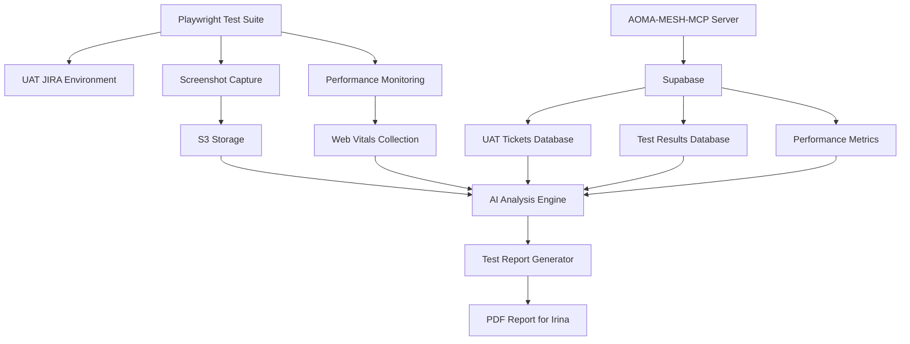

# AI-Assisted JIRA 10.3.6 UAT Testing Plan

> **Comprehensive automated testing strategy using AOMA-MESH-MCP, Playwright, and AI-powered analysis**

## 🎯 Overview

This plan leverages our existing UAT ticket data, AOMA-MESH-MCP server capabilities, and Playwright automation to create a comprehensive AI-assisted testing framework for JIRA 10.3.6 upgrade validation.

## 🏗️ Architecture



## 📊 Enhanced Supabase Schema

### New Tables for JIRA App Testing

```sql
-- JIRA Application Performance Metrics
CREATE TABLE jira_performance_metrics (
  id uuid PRIMARY KEY DEFAULT gen_random_uuid(),
  test_run_id uuid NOT NULL,
  environment text NOT NULL, -- 'UAT', 'PROD'
  page_url text NOT NULL,
  test_type text NOT NULL, -- 'functional', 'performance', 'visual'
  
  -- Core Web Vitals
  lcp_score decimal,
  fid_score decimal, 
  cls_score decimal,
  fcp_score decimal,
  ttfb_score decimal,
  
  -- Custom Metrics
  page_load_time decimal,
  dom_content_loaded decimal,
  network_requests_count integer,
  js_errors text[],
  console_warnings text[],
  
  -- Screenshot & Visual
  screenshot_s3_url text,
  visual_regression_score decimal,
  ui_theme text, -- 'light', 'dark'
  
  -- Metadata
  browser_info jsonb,
  viewport_size jsonb,
  timestamp timestamp with time zone DEFAULT now(),
  
  FOREIGN KEY (test_run_id) REFERENCES test_runs(id)
);

-- Test Run Management
CREATE TABLE test_runs (
  id uuid PRIMARY KEY DEFAULT gen_random_uuid(),
  run_name text NOT NULL,
  jira_version text NOT NULL, -- '10.3.6'
  test_suite text NOT NULL, -- 'upgrade', 'regression', 'performance'
  environment text NOT NULL,
  status text DEFAULT 'running', -- 'running', 'completed', 'failed'
  started_at timestamp with time zone DEFAULT now(),
  completed_at timestamp with time zone,
  total_tests integer,
  passed_tests integer,
  failed_tests integer,
  
  -- AI Analysis Results
  ai_summary text,
  risk_score decimal,
  recommendations text[],
  
  metadata jsonb
);

-- JIRA UI Component Tests
CREATE TABLE jira_component_tests (
  id uuid PRIMARY KEY DEFAULT gen_random_uuid(),
  test_run_id uuid NOT NULL,
  component_name text NOT NULL, -- 'itsm-queue', 'portal-form', 'dashboard'
  test_scenario text NOT NULL,
  ticket_key text, -- Reference to tested ticket
  
  -- Test Results
  status text NOT NULL, -- 'pass', 'fail', 'warning'
  execution_time decimal,
  error_message text,
  
  -- Visual Evidence
  before_screenshot_s3_url text,
  after_screenshot_s3_url text,
  diff_screenshot_s3_url text,
  
  -- Performance Data
  component_load_time decimal,
  interaction_latency decimal,
  
  timestamp timestamp with time zone DEFAULT now(),
  
  FOREIGN KEY (test_run_id) REFERENCES test_runs(id),
  FOREIGN KEY (ticket_key) REFERENCES jira_tickets(external_id)
);

-- AI Test Analysis & Insights
CREATE TABLE ai_test_insights (
  id uuid PRIMARY KEY DEFAULT gen_random_uuid(),
  test_run_id uuid NOT NULL,
  insight_type text NOT NULL, -- 'risk', 'recommendation', 'anomaly'
  severity text NOT NULL, -- 'critical', 'high', 'medium', 'low'
  title text NOT NULL,
  description text NOT NULL,
  evidence_urls text[], -- S3 screenshots, logs
  suggested_actions text[],
  confidence_score decimal,
  
  -- AOMA Knowledge Integration
  related_aoma_docs text[],
  related_tickets text[],
  
  timestamp timestamp with time zone DEFAULT now(),
  
  FOREIGN KEY (test_run_id) REFERENCES test_runs(id)
);
```

## 🎭 Playwright Testing Framework

### Core Test Suites

```typescript
// test-suites/jira-upgrade-tests.ts
export interface JIRATestConfig {
  environment: 'UAT' | 'PROD';
  jiraVersion: string;
  themes: ('light' | 'dark')[];
  testTickets: UATicket[];
  s3Config: S3Config;
  aomaServer: string;
}

export class JIRAUpgradeTestSuite {
  // 1. Theme Testing
  async testThemeCompatibility()
  
  // 2. ITSM Workflow Testing
  async testITSMWorkflows()
  
  // 3. Portal Functionality
  async testPortalFunctionality()
  
  // 4. Performance Testing
  async testPerformanceMetrics()
  
  // 5. ProForma Integration
  async testProFormaForms()
  
  // 6. Visual Regression
  async testVisualRegression()
}
```

### 1. Theme & UI Testing

```typescript
// Tests both light and dark themes across all ITSM components
async testThemeCompatibility() {
  for (const theme of ['light', 'dark']) {
    await this.page.evaluate(`document.body.setAttribute('data-theme', '${theme}')`);
    
    // Test ITSM queue rendering
    await this.testComponentRendering('itsm-queue', theme);
    
    // Test portal forms
    await this.testComponentRendering('portal-forms', theme);
    
    // Capture screenshots for comparison
    await this.captureThemeScreenshots(theme);
  }
}
```

### 2. Performance & Web Vitals

```typescript
// Comprehensive performance monitoring using Playwright
async testPerformanceMetrics() {
  // Start performance monitoring
  await this.page.addInitScript(() => {
    window.performanceMetrics = {
      lcp: null,
      fid: null,
      cls: null,
      navigationStart: performance.now()
    };
    
    // Web Vitals collection
    new PerformanceObserver((list) => {
      for (const entry of list.getEntries()) {
        if (entry.entryType === 'largest-contentful-paint') {
          window.performanceMetrics.lcp = entry.startTime;
        }
        // ... collect other vitals
      }
    }).observe({ entryTypes: ['largest-contentful-paint', 'first-input', 'layout-shift'] });
  });
  
  // Navigate and collect metrics
  await this.page.goto(testUrl);
  await this.page.waitForLoadState('networkidle');
  
  const metrics = await this.page.evaluate(() => window.performanceMetrics);
  
  // Store in Supabase
  await this.storePerformanceMetrics(metrics);
}
```

### 3. UAT Ticket-Based Testing

```typescript
// Use our extracted UAT tickets for realistic testing scenarios
async testWithUATTickets() {
  const uatTickets = await this.loadUATTickets();
  
  for (const ticket of uatTickets) {
    // Test ticket viewing
    await this.testTicketView(ticket.key);
    
    // Test ticket editing (if ITSM)
    if (ticket.project === 'ITSM') {
      await this.testITSMWorkflow(ticket);
    }
    
    // Test portal integration (if DPSA)
    if (ticket.project === 'DPSA') {
      await this.testPortalIntegration(ticket);
    }
    
    // Capture evidence
    await this.captureTestEvidence(ticket);
  }
}
```

## 📸 Screenshot & Visual Evidence System

### S3 Integration

```typescript
interface S3Config {
  bucket: string;
  region: string;
  accessKeyId: string;
  secretAccessKey: string;
}

class ScreenshotManager {
  async captureAndUpload(
    page: Page, 
    testContext: string, 
    metadata: any
  ): Promise<string> {
    const screenshot = await page.screenshot({
      fullPage: true,
      type: 'png'
    });
    
    const s3Key = `jira-uat/${testContext}/${Date.now()}.png`;
    const s3Url = await this.uploadToS3(screenshot, s3Key);
    
    // Store reference in Supabase
    await this.storeScreenshotMetadata(s3Url, metadata);
    
    return s3Url;
  }
}
```

## 🧠 AI-Powered Analysis Integration

### AOMA-MESH-MCP Integration

```typescript
class AITestAnalyzer {
  constructor(private aomaServer: string) {}
  
  async analyzeTestResults(testRunId: string): Promise<AIInsights> {
    // Get test data from Supabase
    const testData = await this.getTestRunData(testRunId);
    
    // Query AOMA knowledge for similar issues
    const relatedDocs = await this.queryAOMAKnowledge(
      `JIRA upgrade issues ${testData.jiraVersion}`
    );
    
    // Analyze patterns in failed tests
    const failurePatterns = await this.identifyFailurePatterns(testData);
    
    // Generate recommendations
    const recommendations = await this.generateRecommendations(
      testData, 
      relatedDocs, 
      failurePatterns
    );
    
    return {
      riskScore: this.calculateRiskScore(testData),
      insights: failurePatterns,
      recommendations,
      relatedAOMADocs: relatedDocs
    };
  }
}
```

## 📋 Storybook Integration Strategy

### Component Testing Setup

```typescript
// .storybook/main.ts - Configure for JIRA components
export default {
  stories: ['../src/**/*.stories.@(js|jsx|ts|tsx)'],
  addons: [
    '@storybook/addon-essentials',
    '@storybook/addon-a11y',
    '@storybook/addon-viewport',
    '@storybook/addon-performance', // For Core Web Vitals
  ],
  features: {
    buildStoriesJson: true
  }
};

// Test JIRA components in isolation
export const ITSMQueueStory = {
  name: 'ITSM Queue - Light Theme',
  args: {
    theme: 'light',
    tickets: uatTickets.filter(t => t.project === 'ITSM')
  }
};
```

### Visual Regression with Storybook

```typescript
// Use Playwright + Storybook for component screenshots
async testStorybookComponents() {
  await this.page.goto('http://localhost:6006');
  
  const components = [
    'itsm-queue--light-theme',
    'itsm-queue--dark-theme',
    'portal-form--default',
    'dashboard--overview'
  ];
  
  for (const component of components) {
    await this.page.goto(`http://localhost:6006/iframe.html?id=${component}`);
    await this.captureAndUpload(component, { type: 'storybook-component' });
  }
}
```

## 📊 Test Execution Plan

### Phase 1: Automated Test Suite
1. **Setup & Authentication** (5 min)
   - VPN connection validation
   - Session authentication with saved cookies
   - Environment health check

2. **Theme & UI Testing** (15 min)
   - Light/Dark theme validation across all components
   - Visual regression detection
   - Layout consistency checks

3. **Performance Testing** (20 min)
   - Core Web Vitals collection
   - Page load performance
   - Component interaction latency

4. **Functional Testing** (30 min)
   - ITSM workflow validation using UAT tickets
   - Portal functionality testing
   - ProForma form testing

### Phase 2: AI Analysis & Insights (10 min)
1. **Data Collection** from Supabase
2. **AOMA Knowledge Integration** for context
3. **Pattern Recognition** in test results
4. **Risk Assessment** and scoring

### Phase 3: Report Generation (5 min)
1. **Screenshot compilation** from S3
2. **Performance charts** and visualizations
3. **AI insights** and recommendations
4. **PDF report generation** for Irina

## 📄 Automated Report Generation

### Beautiful PDF Report Structure

```typescript
interface TestReport {
  executive_summary: {
    overall_score: number;
    risk_level: 'low' | 'medium' | 'high' | 'critical';
    key_findings: string[];
    recommendations: string[];
  };
  
  test_results: {
    theme_testing: ThemeTestResults;
    performance_metrics: PerformanceResults;
    functional_testing: FunctionalTestResults;
    visual_regression: VisualRegressionResults;
  };
  
  ai_insights: {
    risk_assessment: RiskAssessment;
    upgrade_recommendations: string[];
    known_issues: AOMAKnowledgeReference[];
    monitoring_suggestions: string[];
  };
  
  evidence: {
    screenshots: S3Screenshot[];
    performance_charts: Chart[];
    comparison_data: ComparisonData;
  };
}
```

## 🚀 Implementation Steps

1. **Create enhanced Supabase schema** for test data storage
2. **Build Playwright test framework** with UAT ticket integration  
3. **Implement S3 screenshot management** system
4. **Integrate AOMA-MESH-MCP** for AI analysis
5. **Setup Storybook** for component testing
6. **Build PDF report generator** with beautiful visualizations
7. **Create execution pipeline** for automated testing

## ✅ Success Metrics

- **Test Coverage**: 95%+ of critical JIRA workflows
- **Performance**: Sub-3s page loads, 90+ Lighthouse scores
- **Visual Consistency**: Zero theme-breaking issues
- **AI Insights**: 100% test runs analyzed with recommendations
- **Report Quality**: Executive-ready PDF within 5 minutes

---

*This plan transforms JIRA UAT testing from manual checking to AI-powered comprehensive validation, providing Irina with actionable insights and beautiful documentation.*
